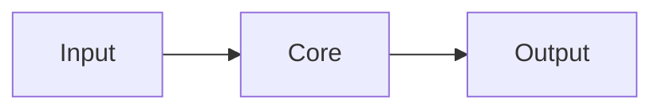

# Architecture

## Scope
- What this system does and does not do.

## Components
- List core modules and their responsibilities.

## Data flow

## Key mechanisms
- State management, retries, reconciliation, caching, scheduling.

## Entrypoints
- API, CLI, jobs, services, configs.

## Boundaries and constraints
- Limits, rate rules, error handling, invariants.

## Related docs
- Links to module docs, PRD, and ops.
