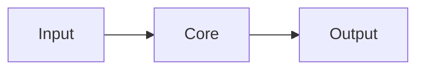

# Architecture

## Scope
- What this system does and does not do.
- Primary users and use cases.

## System context
- Upstream dependencies and downstream consumers.
- External services, data stores, or platforms.

## Components
- List core modules and their responsibilities.

## Repo layout (overview)
```text
<repo>/
  docs/
  src/
```

## Data flow


## Critical flows
- Flow name: short step-by-step description.
- Flow name: short step-by-step description.

## Key mechanisms
- State management, retries, reconciliation, caching, scheduling.

## State model (if applicable)
- Key states and transitions.

## Entrypoints
- API, CLI, jobs, services, configs.
- Keep this high-level and link to user API overview or dev interface docs.

## Boundaries and constraints
- Limits, rate rules, error handling, invariants.

## Scaling and limits
- Throughput/latency targets and bottlenecks.

## Failure modes
- Common failure cases and fallback behavior.

## Observability
- Key logs, metrics, and alerts.

## Related docs
- Links to modules, interfaces, contracts, PRD, and ops.
