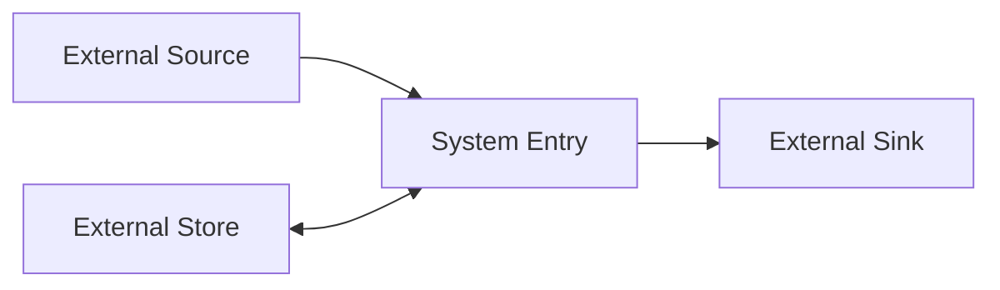
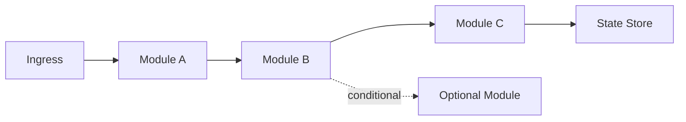

# Architecture

## Scope
- What this system does and does not do.
- Primary users and use cases.

## System context (external)
- Upstream dependencies and downstream consumers.
- External services, data stores, or platforms.
- Quote node labels in Mermaid to avoid parse errors with parentheses or symbols.



## Components
- List core modules and their responsibilities.

## Mechanism map
> Keep this high-level and link to design and mechanism specs.

| Mechanism | Purpose | Owning module | Design doc | Mechanism spec |
|-----------|---------|---------------|------------|----------------|
|           |         |               |            |                |

## Repo layout (overview)
```text
<repo>/
  docs/
  src/
```

## Data flow (internal pipeline)
> Focus on the primary internal path; include conditional or async branches when needed.



## Module I/O matrix (clarity)
| Module | Inputs | Outputs | Transport/Store |
|--------|--------|---------|-----------------|
| <module> | <input payloads> | <output payloads> | <bus/db/api> |
| Ingest Worker | Upstream events | Normalized records | Queue -> DB |

## Data contracts (optional)
| Data artifact | Schema/Format | Versioning | Owner | Compatibility | Notes |
|---------------|---------------|------------|-------|---------------|-------|
| <event or table> | <json/avro/sql> | <semver/rules> | <team> | <backward/forward> | <constraints> |
| `event.ingest` | JSON | semver (schema) | Platform | backward | Required fields: `id`, `type`, `ts` |

## Critical flows
> Reference nodes from the internal pipeline diagram to make the path explicit.
- <Flow name>: A -> B -> C -> D (key steps, failure points, and recovery).
- <Flow name>: B -> E -> F (key steps, failure points, and recovery).

## Key mechanisms
- State management, retries, reconciliation, caching, scheduling.
- Link to mechanism specs instead of repeating decision rules.

## State model (if applicable)
- Key states and transitions.

## Entrypoints
- API, CLI, jobs, services, configs.
- Keep this high-level and link to user API overview or dev interface docs.

## Boundaries and constraints
- Limits, rate rules, error handling, invariants.

## Scaling and limits
- Throughput/latency targets and bottlenecks.

## Failure modes
- Common failure cases and fallback behavior.

## Observability
- Key logs, metrics, and alerts.

## Related docs
- Links to modules, interfaces, contracts, PRD, and ops.
