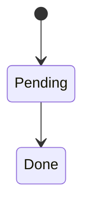

# Design Doc

Use this for mechanism-level design notes and decision records.

## Problem statement
- What problem this design solves.
- Constraints and context.

## Goals and non-goals
- Goals:
- Non-goals:

## Design overview
- High-level approach and components.

## Data model (if applicable)
| Entity | Description | Key fields |
|--------|-------------|------------|
|        |             |            |

## State flow (if applicable)

## Algorithm or mechanism
- Step-by-step flow.
- Key invariants.

## Trade-offs
- Alternatives considered and why rejected.

## Failure modes
- Known failure cases and mitigations.

## Rollout and migration
- Backward compatibility.
- Feature flags or staged rollout.

## Observability
- Metrics and alerts.

## Related docs
- Link to architecture, modules, interfaces, and contracts.
