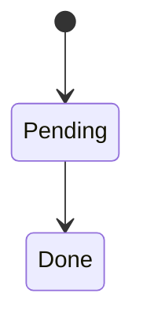

# Design Doc

Use this for mechanism-level design notes and decision records.

## Problem statement
- What problem this design solves.
- Constraints and context.

## Goals and non-goals
- Goals:
- Non-goals:

## Design overview (narrative)
- Write 1-3 short paragraphs.
- Explain why this design exists and how it works at a high level.
- Keep it readable without implementation details.

## Mechanism spec (link)
- Required when decision logic is non-trivial or stateful.
- Link to the mechanism spec; do not duplicate rule details.

## Data model (if applicable)
| Entity | Description | Key fields |
|--------|-------------|------------|
|        |             |            |

## State flow (if applicable)

## Algorithm or mechanism (summary)
- Step-by-step summary only.
- Key invariants.
- Link to the mechanism spec for full decision rules.

## Trade-offs
- Alternatives considered and why rejected.

## Failure modes
- Known failure cases and mitigations.

## Rollout and migration
- Backward compatibility.
- Feature flags or staged rollout.

## Observability
- Metrics and alerts.

## Related docs
- Link to architecture, modules, interfaces, and contracts.
