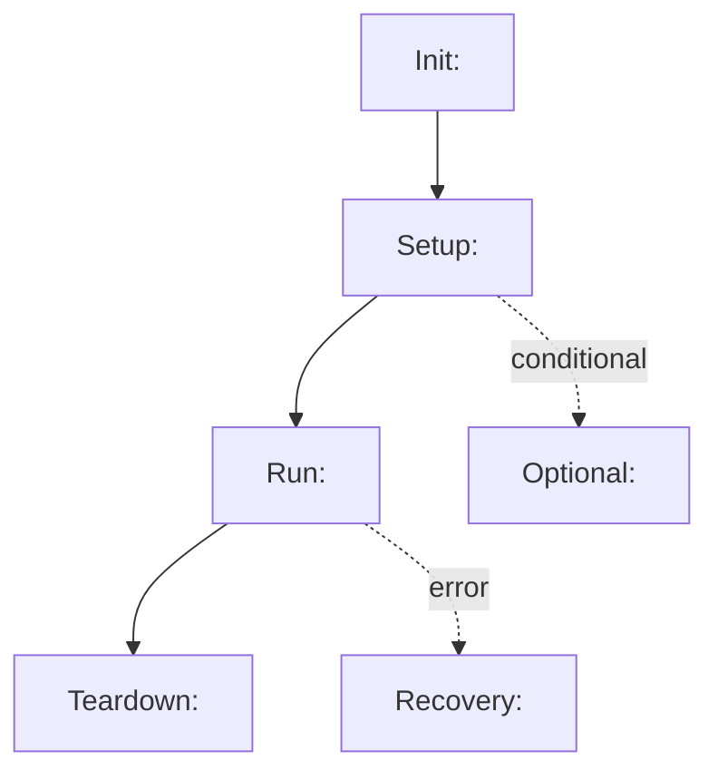

# Lifecycle Example Template

Use this to show a full module lifecycle: all public entrypoints, call order,
and each interface's role in the lifecycle. Provide full coverage plus a runnable
happy-path subset.

## Goal
- <User goal in one sentence>

## Scope / Non-goals
- Scope: <what this walkthrough covers>
- Non-goals: <what it does not cover>

## Coverage rules
- Include every public entrypoint from `docs/dev/interfaces/*`.
- If a step is conditional or not directly runnable, label it and explain preconditions.

## Preconditions
- Auth/config required.
- Required environment state.
- Required setup steps.

## Interface coverage (must be complete)
| Interface | Phase | Role in lifecycle | Runnable? | Preconditions / Notes | Link |
|----------|-------|-------------------|-----------|-----------------------|------|
| <module.Class.method> | <init/setup/run/teardown> | <why it exists> | <yes/no/conditional> | <constraints> | <doc link> |

## Lifecycle flow (diagram)
> Use a flowchart to show the overall lifecycle. Include every public entrypoint
> at least once; use dashed edges for conditional or error flows. Quote node
> labels to avoid Mermaid parse errors with parentheses or symbols.



## Lifecycle steps (index list)
> Short, ordered list that mirrors the diagram and covers all public entrypoints.

| # | Phase | Interface | Role (short) | Output | Runnable | Preconditions | Link |
|---|-------|-----------|--------------|--------|----------|---------------|------|
| 1 | Init | `<module.init(config)>` | <why it exists> | <return shape> | <yes/no/conditional> | <assumptions/limits> | <doc link> |
| 2 | Setup | `<module.prepare(handle, options)>` | <why it exists> | <return shape> | <yes/no/conditional> | <assumptions/limits> | <doc link> |
| 3 | Run | `<module.execute(handle, payload)>` | <why it exists> | <result> | <yes/no/conditional> | <assumptions/limits> | <doc link> |
| 4 | Teardown | `<module.close(handle)>` | <why it exists> | <result> | <yes/no/conditional> | <assumptions/limits> | <doc link> |

## Runnable happy-path subset (minimal)
> Keep this strictly runnable and minimal; no conditional branches.

```pseudo
# Happy-path (minimal, runnable)
ctx = Module.init(config)
Module.prepare(ctx, options)
result = Module.execute(ctx, payload)
Module.close(ctx)
```

## Lifecycle example (code, full coverage)
> Use runnable-first code to cover as many entrypoints as possible. Every public
> entrypoint must appear at least once (happy path or conditional). Mark any
> non-runnable lines as conditional or pseudo.

```pseudo
# Full lifecycle example (runnable-first, full coverage)
config = load_config()
ctx = Module.init(config)

# optional preflight (conditional)
if config.preflight_enabled:
    Module.preflight(ctx)

Module.prepare(ctx, options)

# optional warmup (conditional)
if options.warmup:
    Module.warmup(ctx)

try:
    result = Module.execute(ctx, payload)

    # optional follow-up (conditional)
    if result.needs_sync:
        Module.sync(ctx, result)
except ModuleError as err:
    # recovery paths (conditional)
    if err.is_retriable:
        Module.retry(ctx, err)
    else:
        Module.rollback(ctx)
    raise
finally:
    Module.close(ctx)
```

## Error + recovery path
- <error in setup> -> <rollback interface> -> <state after rollback>
- <error in run> -> <retry/compensate interface> -> <state after recovery>

## Cleanup / Idempotency
- What must be cleaned up.
- Which interfaces are safe to retry.

## Observability (optional)
- Key logs/metrics per phase.

## Related docs
- <API overview>
- <Interface contracts>
- <Config reference>
