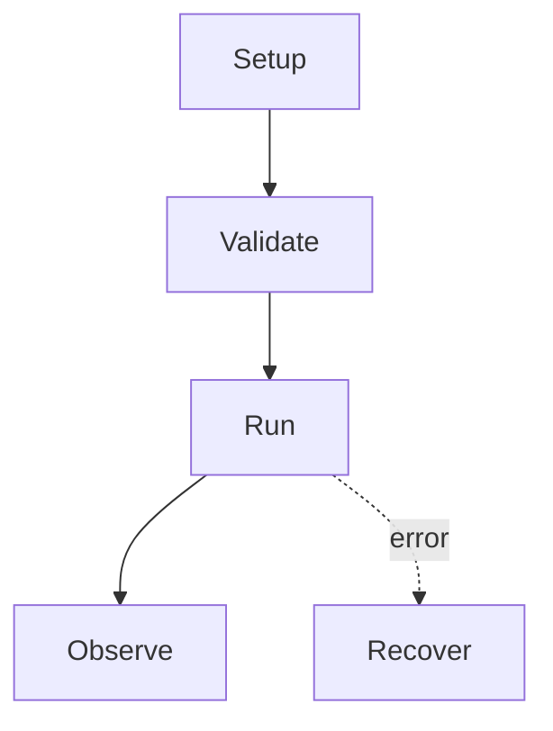

# Lifecycle Example Template

Use this to document a full lifecycle for a module/product/role: public entrypoints, call/run order, states, and verification. Provide full coverage plus a runnable happy-path subset.

## Goal

- <User goal in one sentence>

## Scope / Non-goals

- Scope: <what this walkthrough covers>
- Non-goals: <what it does not cover>

## Coverage Rules

- Include every relevant public entrypoint discovered from code/docs/tooling: CLI commands, API routes, SDK exports, UI flows, config files, env keys, migrations, queues, tables, jobs, scripts, or hooks.
- If a step is conditional or not directly runnable, label it and explain preconditions.

## Preconditions

- Auth/config required.
- Required environment state.
- Required setup steps.

## Entrypoint Coverage

| Entrypoint | Phase | Role in lifecycle | Runnable? | Preconditions / Notes | Design / Contract Source | Validation Evidence |
| --- | --- | --- | --- | --- | --- | --- |
| `<entrypoint>` | `<setup/run/observe/recover>` | `<why it exists>` | `<yes/no/conditional>` | `<constraints>` | `<doc link>` | `<command/test/link>` |

## Lifecycle Flow


```mermaid
flowchart TD
  A["Setup"] --> B["Validate"]
  B --> C["Run"]
  C --> D["Observe"]
  C -. error .-> E["Recover"]
```

## Runnable Happy Path

```bash
<minimal runnable path>
```

## Full Walkthrough

| # | Phase | Entrypoint | Action | Expected Output | Failure / Recovery |
| --- | --- | --- | --- | --- | --- |
| 1 | Setup | `<entrypoint>` | `<action>` | `<observable result>` | `<recovery>` |

## Conditional Paths

- <condition> -> <entrypoint> -> <expected state>

## Cleanup / Idempotency

- What must be cleaned up.
- Which entrypoints are safe to retry.

## Observability

- Key logs, metrics, state rows, artifacts, or UI signals per phase.

## Related Docs

- <Manual index>
- <Architecture>
- <Dev contract>
- <Config reference>
