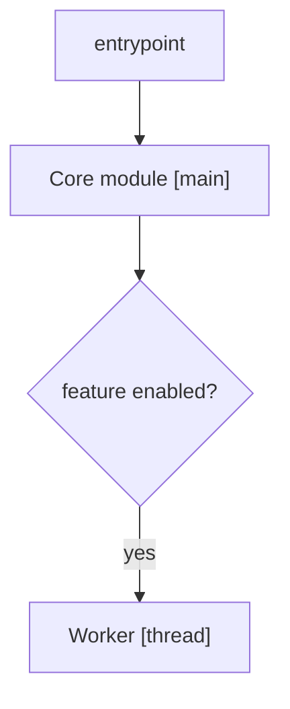
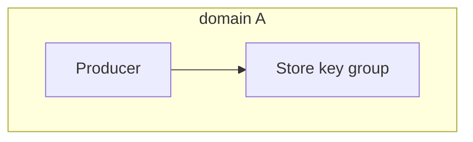

# Module: <name>

## Purpose
- One sentence describing responsibility and boundary.
- What this module does not do.

## Entrypoints
- Classes/functions/commands exposed.

## Inputs and outputs
- Inputs: types and constraints.
- Outputs: structures and semantics.
- Link to interface contracts for full IO details.

## Dependencies
- Upstream dependencies and required services.
- Downstream consumers.

## Module Flow Diagrams
> Required when the module has any of: background threads/processes, stateful store reads/writes,
> multiple entrypoints, or a non-trivial mechanism spec.

### A. Runtime / Startup Dependencies
- Show startup order and conditional branches.
- Label nodes with [main]/[thread]/[process].
- Optional branches use dashed edges and label conditions.



### B. Data Dependencies (Read/Write)
- Split into 2–3 horizontal lanes by domain.
- Use `read` / `write` labels for store edges.
- Replace cross-lane edges with node annotations to avoid line crossings.
- Keep 6–10 nodes per diagram; move full key list below.



### State list (full)
- List full keys/records below the diagram (do not cram into nodes).

## Directory layout
```text
<module>/
  <subdir>/
  <key_file>.py
```

## State and lifecycle
- Key states and transitions.

## Mechanism summary
- 3-5 sentences describing the decisions this module makes and why.
- Keep this at behavior level; avoid implementation details.

## Mechanism spec (link)
- Required when decision logic is non-trivial or stateful.
- Link to the mechanism spec; do not duplicate rule details.

## Error handling
- Common failures and recovery paths.

## Performance and limits
- Throughput/latency considerations.
- Rate limits or size bounds.

## Examples
- Minimal and typical usage (2-3 examples max, not full API coverage).
- Link to a full lifecycle example when the module has a multi-step lifecycle.

## Full lifecycle example (link)
- Required when the module exposes multiple public entrypoints or recovery flows.
- Link to the user-facing lifecycle example (single page or lifecycle index); do not duplicate full IO details.

## Related docs
- Links to PRD, design, interface contracts, or other modules.
