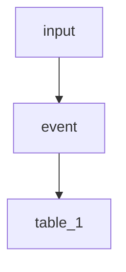
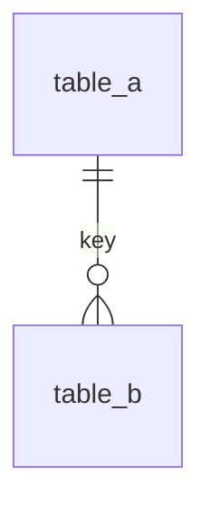

# Storage Domain: <domain_name>

## Summary
- Business focus:
- Why this domain is separate:
- Owners:

## Tables
| Table | Role | Producer (writes) | Consumers (reads) | Source event |
| --- | --- | --- | --- | --- |
| | | | | |

## Domain record flow

## Domain relationships

## Write pattern
- Insert strategy and idempotency.
- Conflict handling rules.

## Conventions
- Time, units, and ID usage.
- JSONB payload linkage.

## Related docs
- Storage index:
- Storage overview:
- Cross-domain relationships:
- Table docs:
