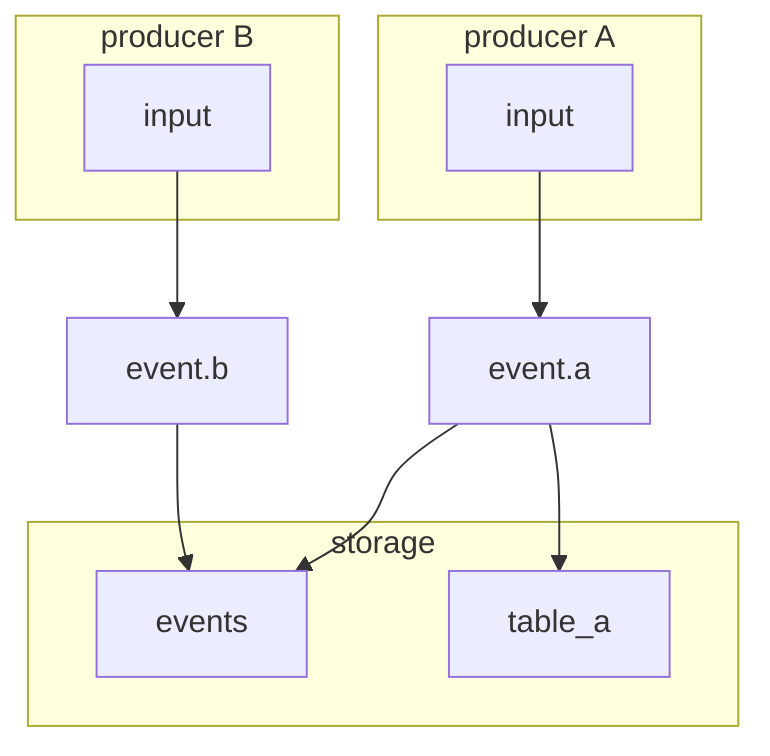
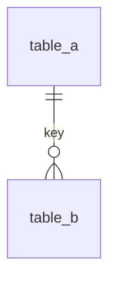

# Storage Overview

## Goal
- What this storage layer exists to support.
- What it does not attempt to solve.

## Table roles
- `events`:
- <derived table>:

## Table inventory
| Table | Role | Producer (writes) | Consumers (reads) | Source event |
| --- | --- | --- | --- | --- |
| | | | | |

## Event to table mapping
| Event type | Table |
| --- | --- |
| | |

## Record-flow diagram (end-to-end)
Show how a full business flow writes into storage. Indicate one-row-per-event assumptions and where they diverge.

## Relationships
- Key linkages and join paths.
- Include a logical ER diagram when multiple derived tables exist.

## Write pattern
- Insert strategy and idempotency.
- Conflict handling or dedupe rules.

## Conventions
- Time, units, encoding, and ID conventions.
- Any JSONB payload linkage to event contracts or schemas.

## Gaps / TODO
- Missing indexes, retention rules, or backfill notes.

## Related docs
- Storage contract:
- Data relationships:
- Conventions:
- Module docs:
