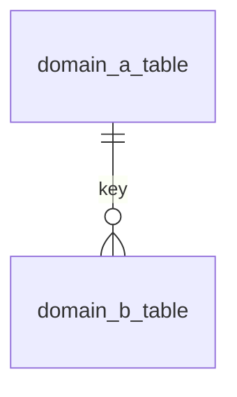

# Storage Relationships (Cross-Domain)

## Purpose
- Explain how domains connect and the join paths between them.

## Relationship map

## Key linkages
| From | To | Key | Notes |
| --- | --- | --- | --- |
| | | | |

## Event lineage
| Event type | Domain | Table | Notes |
| --- | --- | --- | --- |
| | | | |

## Edge cases
- Events that only land in `events`.
- One-to-many or optional joins.

## Related docs
- Storage index:
- Domain overviews:
- Storage overview:
- Data relationships:
